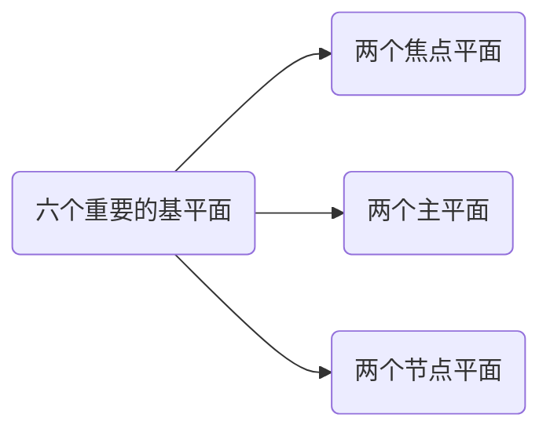
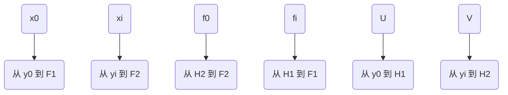
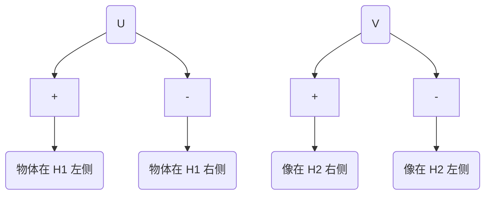
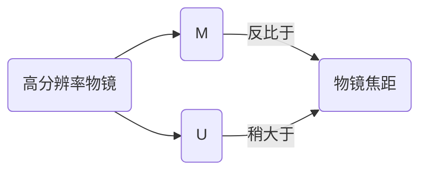

参考 John C. H. Spence 著作的 《High-Resolution Electron Microscopy》(Fourth Edition, Oxford university press)。

<!-- TOC GFM -->

* [1. 与电子波长相关的一些内容](#1-与电子波长相关的一些内容)
	- [1.1 电子显微镜的四个问题](#11-电子显微镜的四个问题)
	- [1.2 波长 $\lambda$](#12-波长-lambda)
		+ [1.2.1 阳极处的波长](#121-阳极处的波长)
		+ [1.2.2 穿过样品后的波长](#122-穿过样品后的波长)
* [2. 简单透镜特点](#2-简单透镜特点)
	- [2.1 理想透镜与透镜方程](#21-理想透镜与透镜方程)
	- [2.2 电子透镜中其他常用名字](#22-电子透镜中其他常用名字)
		+ [2.2.1 横向放大率](#221-横向放大率)
		+ [2.2.2 角放大率](#222-角放大率)
		+ [2.2.3. 入瞳与出瞳（entrance and exit pupils）](#223-入瞳与出瞳entrance-and-exit-pupils)
		+ [2.2.4. 高斯参考球](#224-高斯参考球)
		+ [2.2.5. 纵向放大率](#225-纵向放大率)
		+ [2.2.6. 非相干成像理论](#226-非相干成像理论)

<!-- /TOC -->

## 1. 与电子波长相关的一些内容

### 1.1 电子显微镜的四个问题

与其使用 Schrodinger 方程将电子显微镜作为一个整体去研究，将其拆分为四个问题更为简单。

1. 电子束与样品的相互作用
2. 磁透镜作用
3. 检测
4. 快速电子源

波长这部分归于快速电子。

### 1.2 波长 $\lambda$ 

#### 1.2.1 阳极处的波长

根据 ***de Broglie*** 关系式，

$$
p = mv = h/\lambda
$$

以及 

$$
E = 1/2mv^2
$$

根据能量守恒定律，分析带有 $-e$ 电荷的电子穿过电势从 $0$ 到 $V_0$ 变化的区域。可以得到

$$
eV_0 = p^2/2m = h^2/2m\lambda^2 \tag{1}
$$

其中 $P$ 为 电子的动量，而 $h$ 为 ***Plank's*** 常量。PS：$eV$ 代表电子伏特，是能量单位，代表一个电子经过 1 伏特电位差加速后获得的动量。$1 eV = 1.6021766208(98) \times 10^{-19} J$ 

$$
\lambda = \frac{h}{\sqrt{2meV_0}} \tag{2}
$$

一个电子离开具有高势能以及高热动能的灯丝，并以无势能和高动能到达阳极。势能为零取接地电位。如果 $\lambda$ 以纳米为单位，$V_0$ 以伏特为单位，有

$$
\lambda = 1.22639/\sqrt{V_0} \tag{3}
$$

在使用更高能量时，就需要考虑电子的相对论变化。比如在 100 kV 时，忽略这一点会导致 $\lambda$ 产生 5 % 的误差。经过相对论修正后的质量为

$$
m = m_0/(1 - v^2/c^2)^{1/2} 
$$

对应于 $eqn(1)$ 的相对论方程为

$$
eV_0 = (m - m_0)c^2
$$

其中 $m_0$ 为电子静止状态下的质量，$c$ 是光速。这些等式可以结合并给出电子动量 $mv$ 的表达式。在 ***de Broglie*** 关系式中使用，给出相对论修正的电子波长为

$$
\lambda = h/(2m_0eV_r)^{1/2} \tag{4}
$$

其中

$$
V_r = V_0 + \left(\frac{e}{2m_0c^2}\right)V_0^2
$$

这里为了表述方便，引入$V_r$，称为 **"相对论加速电压"**。电脑计算时，$\lambda$ 可以取

$$
\lambda = 1.22639/(V_0 + 0.97845 \times 10^{-6}V_0^2 )^{1/2} \tag{5}
$$

其中 $V_0$，显微镜加速电压单位为伏特，$\lambda$ 单位为纳米。

#### 1.2.2 穿过样品后的波长

样品内部的正静电电位 $\phi(r)$ 会进一步加速入射的快速电子，导致样品中的波长会少量降低。

 

<strong>图1.</strong> 电子显微镜势能（PE）的简单示意图。垂直箭头的长度与快速电子动能呈正比，与快速电子波长的平方成反比。电子势能（图中以高度表示）和电子的动能的总和是不变的。电子在离开灯丝时具有低动能与高势能（由高压装置提供），势能在通向阳极过程中逐渐转变为动能（阳极处为地电位)。就像小球从山上滚下来，跌进样品中一样。在显微镜立柱（microscope column）中向下的大概距离由横坐标表示，样品处的电位跃阶（potential step）被夸张展示。

忽略引起衍射和色散表面构造的周期性电位变化，内部电位的平均值由 $\upsilon_0 = \phi_0$ 给出，即电位的零阶傅里叶系数。 真空中波长 $\lambda$ 与电子进入样品后波长 $\lambda'$ 之间的比可以由材料中的折射率 $n$ 来表示。

$$
n = \frac{\lambda}{\lambda'}=\frac{\left(\frac{1.23}{\sqrt{V_0}}\right)}{\left(\frac{1.23}{\sqrt{V_0 + \phi_0}}\right)}\approx 1 + \frac{\phi_0}{2V_0} \tag{6}
$$

快速电子穿过厚度为 $t$ 的样品后，相对于真空中的相位差为

$$
\theta = 2\pi(n-1)t/\lambda = \pi\phi_0t/\lambda V_0 = \sigma\phi _0t \tag{7}
$$

结合 $eqn(1)$，我们可以得到

$$
\begin{aligned}
\sigma & = \pi/\lambda V_0 \\
& = 2\pi me\lambda/h
\end{aligned}
$$

如果利用沿单一光路，如 $AB$ ,来估计出射面波函数（不考虑如 $CA$ 通路）, 如图2所示。

<strong>图2.</strong> 电子波穿过样品的两种情况。穿过原子中心（电势更高）的电子会降低波长，相对于从原子之间通过而不改变波长的电子，会发生波相位提前。在相位光栅近似中，这一最简单模型的假设是在 $A$ 处的振幅可以沿光路 $AB$ 计算而 $A$ 处没有来自诸如 $C$ 点的贡献；。对于厚样品，这种近似效果不好。

## 2. 简单透镜特点

现代电子显微镜有着许多焦距可变的成像透镜，为聚焦的目的，需要固定物体及最终观察用的屏幕位置。在高分辨率显微镜中常用的高放大倍率下，例如$L2$，$L3$，及 $L3$ 的透镜电流（决定了焦距）能够被用来调节放大倍率，如图3所示。对于固定放大倍率的配置下，可通过调整物镜 $L1$ 的强度直至固定的 $P1$ 平面与样品的出射面共轭来实现对焦。

 

<strong>图3.</strong> 在高放大倍率下使用的，具有两个聚光透镜（condenser lenses），$C1$ 和 $C2$，以及四个成像透镜，$L1$，$L2$ 和 $L3$ 的电子显微镜示意图。典型的 $D1$ 至 $D7$ 尺寸以及可能的焦距范围于表1给出。其中 $OA$ 是物镜孔径，$P1$ 是固定平面，$SA$ 是选定区域的孔径。

| 透镜间的估计距离 (mm) | 焦距范围 (mm)       |
|-----------------------|---------------------|
| D1 = 143.6            | 1.65  < f(C1) < 19  |
| D2 = 94.3             | 30 < f(C2) < 1060   |
| D3 = 251.4            | 15.4 < f((L2) < 281 |
| D4 = 215.5            | 3.1 < f((L3) < 99.5 |
| D5 = 44.9             | 2.06 < f(L4) < 16.4 |
| D6 = 73.6             |                     |
| D7 = 345.6            |                     |

<strong>表1.</strong> 典型电子显微镜的电子光学数据。对于放大倍率超过 100 000 情况，放大倍数通过 $f(L2) = 15.4mm$ ，$f(L4) = 2.1 mm$ 固定不变，调整 $L3$ 的焦距来进行控制。$L3$ 焦距分别以以下参数进行设置： $f(L3) = 9.9，7.0，5.0，3.1 mm$ 对应 $M = 150，200，400，750 K$ 。

### 2.1 理想透镜与透镜方程

理想透镜是一种数学上的抽象，可以通过物体和图像空间的投影变换来提供完美的成像。在这一变换中出现的常数，指定了透镜基平面的位置。六个重要的基平面包括两个焦点平面、两个主平面以及两个节点平面，如图4所示。

 

<strong>图4.</strong> 厚透镜。节点平面（$N1$，$N2$），主平面（$H1$，$H2$）以及焦点平2022-04-04-electron-optics-1.md*面 （$F1$，$F2$）。透镜焦距为 $f_i$，$f_0$，物焦距为 $z_p$ 。对于磁电子透镜，主平面是交叉的。

从图中总结，$x_0$，$x_i$，$f_0$，$f_i$，$U$，以及 $V$ 分别表示为

 

对于磁透镜，**节点平面与主平面重合**。轴与节点平面相交的点成为节点，$N1$ 与 $N2$。**主平面为单位横向放大平面**，而**节点平为单位角度放大平面**。对于轴对称透镜，完美成像的投影可以简化为牛顿透镜方程:

$$
\frac{y_i}{y_0} = \frac{f_i}{x_0} = \frac{x_i}{f_0} \tag{8}
$$

解决这些平面的位置是解决电子透镜的关键问题，满足 $eqn(8)$ 图像的图形构造规则可以用于找到任意物体的图像。

 

从已知物点 $P$ 构建共轭像点 $P'$ 的规则：

1. 通过 $P$ 和 $F_1$ 画一条射线，与 $H1$ 平面交于 $Q$。通过 $Q$ 平行于轴画出射线 $YQ$，延伸到物体和图像空间。
2. 通过 $P$ 平行于轴绘制射线并与 $H2$ 相交。从这个交点画一条穿过 $F2$ 的射线，与 $YQ$ 在 $P$ 处相交于 $P'$。$P'$ 是 $P$ 的像。

以中等放大倍率（~ 40,000）的现代的电子显微镜为例，如图5所示。在四透镜材中使用这种模式对于必须将辐射损伤降到最低的生物样品具有优势。在中等放大倍率中透镜 $L3$ 被关闭. 在高放大倍率下，所有透镜均被使用。现代透镜的设计师使用矩阵光学的放大。

<strong>图5.</strong> 中等放大倍率的物镜射线图。物焦距与像焦距与磁透镜相等。典型的 $f_2$ 值为 2 mm，放大倍数 $M = V/U$ 大约为 20。

如果物距（ $U$ ）和像距（ $V$ ）从透镜主平面 $H1$ 和 $H2$ 位置测量，简单的薄透镜公式仍然使用。$eqn(8)$ 变为

$$
\frac{f_i}{U} + \frac{f_0}{V} = 1
$$

因为对于磁电子透镜，物体和图像空间中的折射率相等，我们有

$$
f_i = f_0 = f \tag{9}
$$

又因为在物体出现在 $H1$ 左侧（右侧）时，$U$ 为正（负）；像出现在 $H2$ 右侧（左侧）时，$V$ 为正（负）。

可以推导出

$$
\frac{1}{U} + \frac{1}{V} = \frac{1}{f} \tag{10}
$$

从 $eqn(10）$ 中分析, 存在三种情况：

1. $U < f$ ：像是虚像、直立的、放大的。
2. $f < U < 2f$ ：像是实像、倒置的、放大的。
3. $U > 2f$ ：像是实像、倒置的、缩小的。

### 2.2 电子透镜中其他常用名字

#### 2.2.1 横向放大率

***横向放大率*** $M$ 由以下给出：

$$
M = \frac{y_i}{y_0} = - \frac{V}{U} \tag{11}
$$

从 $eqn(10)$ 以及 $eqn(11)$，我们有

$$
M - 1 = - \frac{V}{f} \tag{12}
$$

从 $eqn(11)$ and $eqn(12)$ 可以得到

#### 2.2.2 角放大率

***角放大率*** $m$ 对于小角度有

$$
m = \frac{\tan{\theta_i}}{\tan{\theta_0}} \approx \frac{\theta_i}{\theta_0} = \left|\frac{1}{M}\right| \tag{13}
$$

如图6所示，

<strong>图6.</strong> 角放大率。点 $P$ 与其像 $P'$ 同时给出。

#### 2.2.3. 入瞳与出瞳（entrance and exit pupils）

透镜的**入瞳与出瞳**系统对于限制分辨率以及聚光能力是重要的。

**入瞳**：由其前面的光学系统形成的光圈的图像，以最小角度与物体相对。

**出瞳**：通过整个系统形成的入瞳的像。

**孔径光阑（aperture stop）** 是其像形成入瞳的物理孔径。

详情见图7 ~ 图9：

<strong>图7.</strong> 透镜系统的入瞳与出瞳。复杂的透镜系统由许多镜共同组成，可以以整体看成一个黑盒子，由入瞳、出瞳以及复杂的传递函数制定。惠更斯（Huygens）球面波前会聚在点 $P$ 。

以相机为例，解释一下入瞳与出瞳

<strong>图8.</strong> 相机镜头调整光圈大小。入瞳是物理光圈的像，可以从前方（物体方）看到。物理孔径大小和位置也许会因为镜头的放大倍率不同而存在差异。

<strong>图9.</strong> SLR相机镜头的图像方；出瞳是在镜头中间的发亮区域。

#### 2.2.4. 高斯参考球

***高斯参考球（The Gaussian reference sphere）***对于一个定义为球形的像点 $P$ ，以 $P$ 为中心，通过光轴与出瞳的交点。如图7所示。

对于无像差的光学系统，向 $P$ 会聚的惠更斯球面小波的恒相位面与该参考球面重合。**波前与高斯参考求面的偏差制定了系统的像差。**而衍射极限极限由出瞳或等效入瞳的有效大小施加的。 

#### 2.2.5. 纵向放大率

***纵向放大率***，$M_z$，可以用于将联景深与焦距联系起来。

求 $eqn(10)$ 的微分可以得到

$$
\begin{aligned}
d\left(\frac{1}{V}\right) + d\left(\frac{1}{U}\right) & = d\left(\frac{1}{f}\right) \\
-\frac{1}{V^2}dV - \frac{1}{U^2}dU & = 0 \\ 
\frac{dV}{dU} & = - \frac{V^2}{U^2} \\
\end{aligned} \tag{14}
$$

最终获得

$$
\frac{\Delta V}{\Delta U} = - M^2 = M_z
$$

例如，如果横向放大倍数 $M$ 为 100 000，则与 0.3 nm “厚”原子的上下表面共轭的图像平面相隔 3 m。

#### 2.2.6. 非相干成像理论

***非相干成像理论***给出了景深或聚焦范围值（称为物平面），在该值上，一个物点可以视“聚焦”

$$
Z_D = 2d/\theta = 2\lambda/\theta^2 \tag{15}
$$

其中 $\theta$ 是物镜孔径半角，$d$ 是显微镜分辨率。然而，这一结果并无法准确应用于相位物体的相干高分辨率成像。

透镜设计者用来确定电子透镜基面位置的方法将在下一篇博文中进行讨论。从图4 可以看出，**平行于轴进入（离开）的光线与轴的交叉点定义了图像（对象）焦点**。在电子光学中，一旦电子的运动方程可以针对特定的磁场分布求解，则平行于轴进入透镜场的电子轨迹可以类似地用于找到透镜焦点。真实的电子轨迹遵循透镜磁场内的平滑曲线。为了使用理想的镜头模型，可能有必要使用来自远在场影响之外的点的光线的虚拟延伸来定义镜头焦点。
