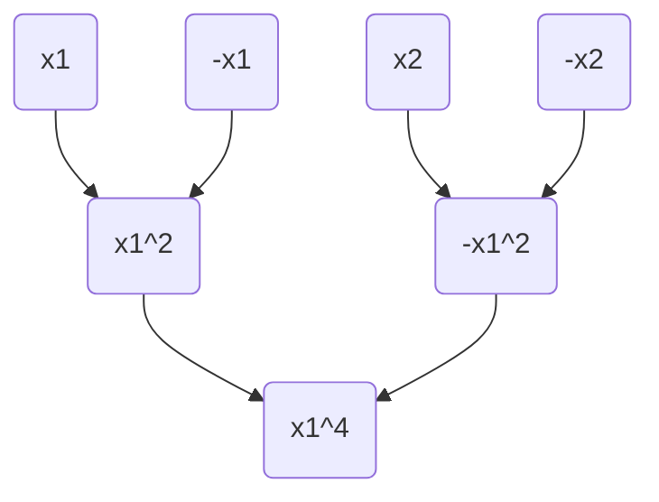
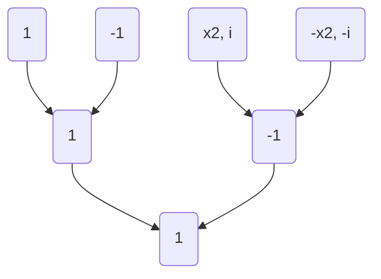
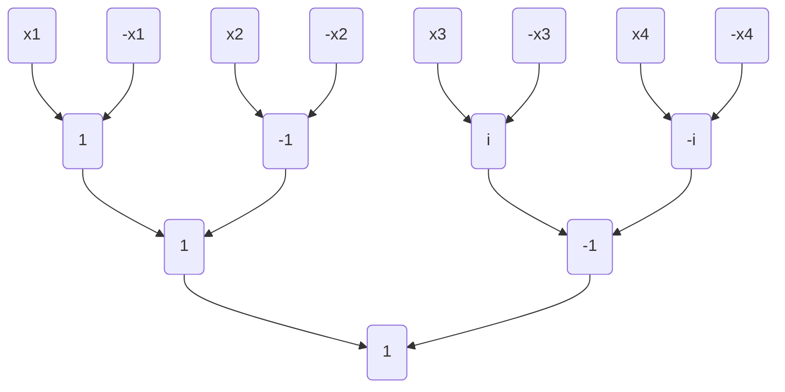

## 多项式表示方法

对于一个多项式,

$$
P(x) = p_{0} + p_{1}x + p_{2}x^{2} + ... + p_{d}x^{d}
$$

通常可以有两种方法去表示：

1. 系数表示法

$$
[p_{0}, p_{1}, ... ,p_{d}]
$$

2. 数值表示法

$$
\lbrace(x_{0}, P(x_{0})), (x_{1}, P(x_{1})), ... , (x_{d}, P(x_{d}))\rbrace
$$

通过数值表示法可以通过如下关系快速确定多项式乘法后的函数关系式：

 

如上图中，

$$
\begin{cases}
A(x) = x^2 + 2x + 1, && [(-2, 1), (-1, 0), (0, 1), (1, 4), (2, 9)] \\ 
 \\ 
B(x) = x^2 - 2x + 1, && [(-2, 9), (-1, 4), (0, 1), (1, 0), (2, 1)]
\end{cases}
$$

通过 $A(x)$ 与 $B(x)$ 的四个数值表示法来确定 $C(x) =  A(x) \cdot B(x)$，

$$
C(x) =  x^4 - 2x^2 + 1, \phantom{kkk}[(-2, 9), (-1, 0), (0, 1), (1, 0), (2, 9)]
$$

从而实现快速多项式乘法。

为了实现这种快速算法，先用系数表示法对多项式乘法进行表示，

$$
\begin{cases}
A(x) = 2 + 3x + x^2, &&& \rightarrow A=[2, 3, 1] \\ 
 \\ 
B(x) = 1 + 0x + 2x^2, &&& \rightarrow B=[1, 0, 2] \\ 
\end{cases}
$$

则可以得出，

$$
\begin{aligned}
C(x) & = A(x) \cdot B(x) & \\ 
&= 2 + 3x + 5x^2 + 6x^3 + 2x^4 \\ 
\rightarrow C &=[2, 3, 5, 6, 2]
\end{aligned}
$$

采用这种方法，可以实现简明的表示多项式乘法，但其实现速度并没有改变，

$$
O(d^2)
$$

继续将这种想法继续代入，这样我们就得到了多项式表示法的一般形式：

$$
C[k] = \text{coeff of} \phantom{k}k^{th} \text{ term of polynomial} \phantom{k} C(x)
$$

## $(d+1)$ 个点确定一个 $d$ 阶多项式

下一步，需要先承认一个定理，即 $(d+1)$ 个点可以确定一个 $d$ 阶多项式。

例如 

$$
\lbrace(-3, 1), (-1, -1), (1, 3)\rbrace
$$ 

可以确定 

$$
P(x)=\frac{3}{4}x^2 + 2x + \frac{1}{4}
$$

 

$$
\lbrace(-1, 0), (0, 1), (1, 0), (2, 1)\rbrace
$$

可以确定

$$
P(x)=\frac{2}{3}x^3 - x^2 - \frac{2}{3}x + 1
$$


用数学关系来表示这一特性，

$$
P(x) = p_{0} + p_{1}x + p_{2}x^2 + ... + p_{d}x^d \\ 
P(x_{0}) = p_{0} + p_{1}x_{0} + p_{2}x_{0}^2 + ... + p_{d}x_{0}^d \\ 
\vdots \\ 
P(x_{d}) = p_{0} + p_{1}x_{d} + p_{2}x_{d}^2 + \dots + p_{d}x_{d}^d 
$$

将该数值表示法代入的关系式用矩阵形式表示有，

$$
\left[
\begin{matrix}
P(x_{0}) \\ 
P(x_{1}) \\ 
\vdots \\ 
P(x_{d})
\end{matrix}
\right]=
\left[
\begin{matrix}
1 & x_{0} & x_{0}^2 & \dots & x_{0}^d \\ 
1 & x_{1} & x_{1}^2 & \dots & x_{1}^d \\ 
\vdots & \vdots & \vdots & \ddots & \vdots \\ 
1 & x_{d} & x_{d}^2 & \dots & x_{d}^d \\ 
\end{matrix}
\right]
\left[
\begin{matrix}
p_{0} \\ 
p_{1} \\ 
\vdots \\ 
p_{d}
\end{matrix} 
\right]
$$

想要证明 $(d+1)$ 个点能够确定一个 $d$ 阶多项式，即证明矩阵中中间的矩阵 $M$ 

$$
\left[
\begin{matrix}
1 & x_{0} & x_{0}^2 & \dots & x_{0}^d \\ 
1 & x_{1} & x_{1}^2 & \dots & x_{1}^d \\ 
\vdots & \vdots & \vdots & \ddots & \vdots \\ 
1 & x_{d} & x_{d}^2 & \dots & x_{d}^d \\ 
\end{matrix}
\right]
$$

为可逆矩阵，即可以证明特定的 $x_{0}, x_{1}, \dots, x_{d}$ 可以提供特定的 $p_{0}, p_{1}, \dots, p_{d}$ 存在，进而证明特定的多项式 $P(x)$ 存在。

## 快速多项式乘法初步流程

于是有了一个解决快速多项式乘法的大致流程方向，如下图

 

简单描述，首先将待处理多项式（ $A(x)$ 与 $B(x)$ ）化为系数表示形式，然后进行数值代入转化为数值表示的形式。通过待乘多项式的数值表示形式获得多项式相乘后关系式（ $C(x)$ ）的数值表示形式，后将多项式乘法结果关系式（ $C(x)$ ）数值表达形式重新转换为系数表示形式以获得多项式乘法最终的结果。

尝试用以上介绍的方法去解决一个问题：

使用 $n \ge (d+1)$ 个点去评估一个多项式：

$$
P(x) = p_{0} + p_{1}x + p_{2}x^2 + \dots + p_{d}x^d
$$

列出数值代入关系式：

$$
\begin{cases}
(1, P(1)) &:& (1, p_{0} + p_{1}\cdot1 + p_{2}\cdot1^{2} + \dots + p_{d}\cdot1^{n}) \\ 
(2, P(2)) &:& (2, p_{0} + p_{1}\cdot2 + p_{2}\cdot2^{2} + \dots + p_{d}\cdot2^{n}) \\ 
 && \vdots \\ 
(n, P(n)) &:& (n, p_{0}+p_{1}\cdot n + p_{2}\cdot n^{2} + \dots + p_{d}\cdot n^{d})
\end{cases}
$$

相应图像示意图如下，


这种算法的计算效率可达

$$
O(nd) \ge O(d^2)
$$

虽然和之前的算法比，感觉速度有所提高，但实际上仍然并不能达到理想中的速度。

## 算法优化

于是要想办法优化这个算法。首先举两个例子，对于 $y=x^{2}$ 和 $y=x^{3}$ 这两个函数式有两个很棒的特征，通过观察两者的函数图像，


可以发现，具有以下特征：

$$
\begin{cases}
y = x^2 &\rightarrow &P(-x)=P(x) \\ 
\\ 
y = x^3 &\rightarrow &P(-x)=-P(x)
\end{cases}
$$

这样算来，本来需要 $n = 8$ 个点才能确定的曲线，理论上仅需要一半的点 $n=4$ 即可实现。

以此为出发点，引入一个例子来说明，比如我们想估计以下多项式

$$
P(x) = 3x^5 + 2x^4 + x^3 + 7x^2 + 5x + 1
$$

首先我们分离偶数与奇数项有

$$
P(x) = (2x^4 + 7x^2 + 1) + x\cdot(3x^4 + x^2 + 5)
$$

其中

$$
\begin{cases}
P_{e}(x^2) = (2x^4 + 7x^2 + 1) \\ 
\\ 
P_{o}(x^2) = (3x^4 + x^2 + 5)
\end{cases}
$$

进而有

$$
P(x) = P_{e}(x^2) + xP_{o}(x^2)
$$

$$
\begin{cases}
P(x_{i}) = P_{e}(x_{i}^2) + x_{i}P_{o}(x_{i}^2) \\ 
 \\ 
P(-x_{i}) = P_{e}(x_{i}^2) - x_{i}P_{o}(x_{i}^2)
\end{cases}
$$

在上面的例子中，我们再次将 $P_{e}(x^2)$ 和 $P_{o}(x^2)$ 当作成上面的 $P(x)$ ，会有

$$
\begin{cases}
P_{e}(x^2) = 2x^2 + 7x + 1 \\ 
 \\ 
P_{o}(x^2) = 3x^2 + x + 5
\end{cases}
$$

从这里就可以看出递归的意思了，这样将原来的 $P(x)$ 的每一部分可以分为 $(n/2 - 1)$ 阶，转换为系数表示法，

$$
\begin{cases}
P_{e}(x_{1}^2)=2, P_{e}(x_{2}^2)=7, P_{e}(x_{3}^2)=1 && \rightarrow [2, 7, 1] \\ 
 \\ 
P_{o}(x_{1}^2)=3, P_{o}(x_{2}^2)=1, P_{o}(x_{3}^2)=5 && \rightarrow [3, 1, 5]
\end{cases}
$$

即问题转换为通过 $\lbrace x_{1}^2, x_{2}^2, \cdots, x_{n/2}^2\rbrace$ 这 $n/2$ 个点估计 $P_{e}(x^2)$ 和 $P_{o}(x^2)$ ，如下图

 

运用这样的递归算法解决以下数值表示的关系点，

$$
\lbrace P(x_{1}), P(-x_{1}), \cdots , P(x_{n}/2), P(-x_{n}/2)\rbrace
$$

这样两个子问题都是原问题的规模的一般，利用递归算法，计算效率可达

$$
O(n\log{n})
$$

但这样计算存在一个问题，即

$$
\begin{cases}
\lbrace \pm x_{1}, \pm x_{2}, \cdots, \pm x_{n/2} \rbrace && \text{正负配对} \\ 
 \\ 
\lbrace x_{1}^2, x_{2}^2, \cdots, x_{n/2}^2 \rbrace && \text{不正负配对}
\end{cases}
$$

会导致递归出现断裂。

## 复数在递归中的使用

用一个更简单的例子来说明，比如去估计 $P(x)=x^3 + x^2 - x - 1$ ，对于这个 $d=3$  阶多项式（最高此项为 3 ），我们只需要确定 $n=4$ 个点即可对其曲线进行估计，



其中我们想要实现的就是第二层中 $x_{1}^2$ 和 $-x_{1}^2$ 应该是一对正负数配对。

设 $x_{1} = 1$，我们可以得到



只需要令 $x_{2}$ 与 $-x_{2}$ 分别为 $i$ 与 $-i$，

本问题研究转化为了求 $x_{i}^4 = 1$ 的四个四次方根。推广到更复杂的稍微更加复杂的情况，

$$
P(x) = x^5 + 2x^4 - x^3 + x^2 + 1
$$

需要 $n\ge  6$ 个点去表示，我们令 $n = 8$ （表示为 2 的次幂更方便处理），

其实仅仅相当于在上面递归关系中多加一层，即



也就转换为了解决 $x_{i}^8 = 1$ 的 8 次方根问题。推广为更一般形式，对于 $d$ 阶多项式，先取 $n\gt d$ 个点，一般取

$$
n = 2^k， k \in \mathit{z}
$$

可以确定一些具有正负成对性质的点，他们是 1 （unity）的 $n^{\mathrm{th}}$ 方根。

而 1 的 $n^{\mathrm{th}}$ 可以被解释为复平面上沿着单位圆等距排列的一系列点。如下图所示


其中定义：

$$
\begin{cases}
\mathit{z}^{n} = 1 \\ 
 \\ 
w = e^{\frac{2\pi i}{n}}
\end{cases}
$$

所以求 1 的 $n^{\mathrm{th}}$ 方根等价于在 $\lbrace 1, w, w^1, w^2, \cdots, w^{n-1}\rbrace$ 上求值，而

$$
w^{j+n/2} = -w^{j}
$$

即 $(w^j , w^{j+n/2})$ 是正负配对的。


而接下来做的即为用 $w$ 替代 $p$ 即可，

$$
\begin{cases}
P(x):[p_{0}, p_{1}, \cdots, p_{n-1}] \\ 
\\ 
w = \exp({\frac{2\pi i}{n}}): [w^0, w^1, \cdots, w^{n-1}]
\end{cases}
$$

对应的 FFT 也就是用 $w$ 表示 $p$ 的过程：

$$
\begin{cases}
P_{e}(x^2):[p_{0}, p_{2}, \cdots, p_{n-2}] \rightarrow [w^0, w^2, \cdots, w^{n-2}] \\ 
\\ P_{o}(x^2):[p_{1}, p_{3}, \cdots, p_{n-1}] \rightarrow [w^0, w^2, \cdots, w^{n-2}]
\end{cases}
$$

用 $w$ 替代 $x$ 重写定义新的函数 $y$，

$$
\begin{cases}
y_{e} = [P_{e}(w^0), p_{e}(w^2), \cdots, P_{e}(w^{n-2})] \\ 
\\ 
y_{o} = [P_{o}(w^0), p_{o}(w^2), \cdots, P_{o}(w^{n-2})] \\ 
\end{cases}
$$

所以原函数式

$$
\begin{cases}
P(x_{j}) = P_{e}(x_{j}^2) + x_{j}P_{o}(x_{j}^2) \\ 
\\ 
P(-x_{j}) = P_{e}(x_{j}^2) - x_{j}P_{o}(x_{j}^2) \\ 
\end{cases} \phantom{kkk} j\in \lbrace{0, 1, 2, \cdots ,(n/2-1)}\rbrace
$$

代入 $x_{j} = w^j$

得出关系式

$$
\begin{cases}
P(w^{j}) = P_{e}(w^{2j}) + w^jP_{o}(w^{2j}) \\ 
\\ 
P(-w^{j}) = P_{e}(w^{2j}) - w^{j}P_{o}(w^{2j}) \\ 
\end{cases} \phantom{kkk} j\in \lbrace{0, 1, 2, \cdots ,(n/2-1)}\rbrace
$$

由

$$
-w^j = w^{j+n/2}
$$

可以推导出，

$$
\begin{cases}
P(w^{j}) = P_{e}(w^{2j}) + w^jP_{o}(w^{2j}) \\ 
\\ 
P(w^{j+n/2}) = P_{e}(w^{2j}) - w^{j}P_{o}(w^{2j}) \\ 
\end{cases} \phantom{kkk} j\in \lbrace{0, 1, 2, \cdots ,(n/2-1)}\rbrace
$$

又由

$$
\begin{cases}
y_{e}[j] = P_{e}(w^{2j}) \\ 
 \\ 
y_{o}[j] = P_{o}(w^{2j})
\end{cases}
$$

最终得到 FFT 的表达形式，

$$
\begin{cases}
P(w^{j}) = y_{e}[j] + w^jy_{o}[j] \\ 
\\ 
P(w^{j+n/2}) = y_{e}[j] - w^{j}y_{o}[j] \\ 
\end{cases} \phantom{kkk} j\in \lbrace{0, 1, 2, \cdots ,(n/2-1)}\rbrace
$$

FFT 输出结果为：

$$
y = [P(w^0), P(w^1), \cdots, P(w^{n-1})]
$$

## FFT 代码实现

```python
def FFT(P):
	# P-[p0, p1, ..., pn-1] coeff representation
	n = len(P) # n is a power of 2
	if n == 1:
		return P
	w = exp((2pi*i)/n)
	Pe, Po = [p0, p2, ... , pn-2], [p1, p3, ... , pn-1]
	ye, yo = FFT(Pe), FFT(Po)
	y = [0] * n
	for j in range(n/2):
		y[j] = ye[j] + w^j*yo[j ]
		y[j+n/2] = ye[j] - w^j*yo[j]
	return y
```


## IFFT 插值问题


如上图所示，插值（interpolation）定义为从值表示形式转换为系数转换形式的过程。

重新回顾 FFT 的过程：

$$
P(x) = p_{0} + p_{1}x + p_{2}x^2 + ... + p_{d}x^d \\ 
P(x_{0}) = p_{0} + p_{1}x_{0} + p_{2}x_{0}^2 + ... + p_{d}x_{0}^d \\ 
\vdots \\ 
P(x_{d}) = p_{0} + p_{1}x_{d} + p_{2}x_{d}^2 + \dots + p_{d}x_{d}^d 
$$

将该数值表示法代入的关系式用矩阵形式表示有，

$$
\left[
\begin{matrix}
P(x_{0}) \\ 
P(x_{1}) \\ 
\vdots \\ 
P(x_{d})
\end{matrix}
\right]=
\left[
\begin{matrix}
1 & x_{0} & x_{0}^2 & \dots & x_{0}^d \\ 
1 & x_{1} & x_{1}^2 & \dots & x_{1}^d \\ 
\vdots & \vdots & \vdots & \ddots & \vdots \\ 
1 & x_{d} & x_{d}^2 & \dots & x_{d}^d \\ 
\end{matrix}
\right]
\left[
\begin{matrix}
p_{0} \\ 
p_{1} \\ 
\vdots \\ 
p_{d}
\end{matrix} 
\right]
$$

用以下关系式代入：

$$
x_k = w^k， w = exp(\frac{2\pi i}{n})
$$

得到，

$$
\left[
\begin{matrix}
P(w^0) \\ 
P(w^1) \\ 
\vdots \\ 
P(w^{n-1})
\end{matrix}
\right]=
\left[
\begin{matrix}
1 & w^{0} & w^{0} & \dots & w^{0} \\ 
1 & w^{1} & w^{2} & \dots & w^{n-1} \\ 
\vdots & \vdots & \vdots & \ddots & \vdots \\ 
1 & w^{n-1} & w^{2(n-1)} & \dots & w^{(n-1)(n-1)} \\ 
\end{matrix}
\right]
\left[
\begin{matrix}
p_{0} \\ 
p_{1} \\ 
\vdots \\ 
p_{d}
\end{matrix} 
\right], \phantom{kkk} w = \exp{(\frac{2\pi i}{n})}
$$

记忆起来可以看作是原来的 $x$ 的下标和上标相乘。中间的矩阵被称为离散傅里叶变换矩阵（Discrete Fourier Transform， DFT 矩阵）。

$$
\left[
\begin{matrix}
1 & w^{0} & w^{0} & \dots & w^{0} \\ 
1 & w^{1} & w^{2} & \dots & w^{n-1} \\ 
\vdots & \vdots & \vdots & \ddots & \vdots \\ 
1 & w^{n-1} & w^{2(n-1)} & \dots & w^{(n-1)(n-1)} \\ 
\end{matrix}
\right]
$$

而解决后续的插值问题即为求 DFT 矩阵的逆

$$
\left[
\begin{matrix}
p_{0} \\ 
p_{1} \\ 
\vdots \\ 
p_{d}
\end{matrix} 
\right]=
\left[
\begin{matrix}
1 & w^{0} & w^{0} & \dots & w^{0} \\ 
1 & w^{1} & w^{2} & \dots & w^{n-1} \\ 
\vdots & \vdots & \vdots & \ddots & \vdots \\ 
1 & w^{n-1} & w^{2(n-1)} & \dots & w^{(n-1)(n-1)} \\ 
\end{matrix}
\right]^{-1}
\left[
\begin{matrix}
P(w^0) \\ 
P(w^1) \\ 
\vdots \\ 
P(w^{n-1})
\end{matrix}
\right], \phantom{kkk} w = \exp{(\frac{2\pi i}{n})}
$$

运用单位方根性质：

1. 对任意整数 $i$ ， $j$，有 $w_i^j = w_j^i$ 。
2. $A = 1 + w_{1}^{m} + w_{2}^m + \cdots + w_{n}^{m}$ ；当 $n\vert m$ 时，$A= n$ ，否则 $A=0$ 。

可以推导出以下

$$
\left[
\begin{matrix}
p_{0} \\ 
p_{1} \\ 
\vdots \\ 
p_{d}
\end{matrix} 
\right]=
\frac{1}{n}\left[
\begin{matrix}
1 & w^{-0} & w^{-0} & \dots & w^{-0} \\ 
1 & w^{-1} & w^{-2} & \dots & w^{-(n-1)} \\ 
\vdots & \vdots & \vdots & \ddots & \vdots \\ 
1 & w^{-(n-1)} & w^{-2(n-1)} & \dots & w^{-(n-1)(n-1)} \\ 
\end{matrix}
\right]
\left[
\begin{matrix}
P(w^0) \\ 
P(w^1) \\ 
\vdots \\ 
P(w^{n-1})
\end{matrix}
\right], \phantom{kkk} w = \exp{(\frac{2\pi i}{n})}
$$

原矩阵中的 $w$ 被 $\frac{1}{n}w^{-1}$ 代替。


巧妙之处，即在于 IFFT 与 FFT 可以定义为同一个函数。

$$
\begin{cases}
\mathrm{IFFT}(\<values\>), && w=\frac{1}{n}\exp{(\frac{-2\pi i}{n}}) \\ 
& \Updownarrow \\ 
\mathrm{FFT}(\<values\>), && w=\exp{(\frac{2\pi i}{n})}
\end{cases}
$$

代码实现仅需变更一个地方，

```python
def IFFT(P):
	# P-[p0, p1, ..., pn-1] coeff representation
	n = len(P) # n is a power of 2
	if n == 1:
		return P
	w = (1/n) * exp((-2pi*i)/n) # 与 FFT 不同之处
	Pe, Po = [p0, p2, ... , pn-2], [p1, p3, ... , pn-1]
	ye, yo = FFT(Pe), FFT(Po)
	y = [0] * n
	for j in range(n/2):
		y[j] = ye[j] + w^j*yo[j ]
		y[j+n/2] = ye[j] - w^j*yo[j]
	return y
```


