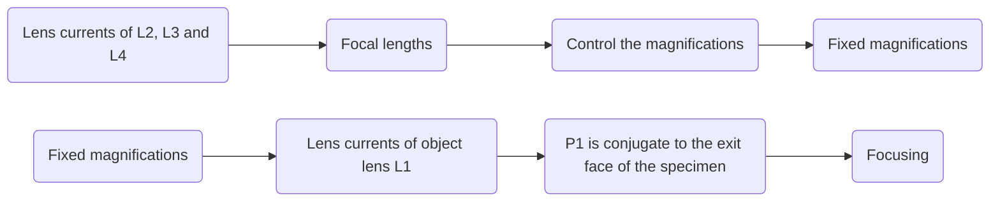
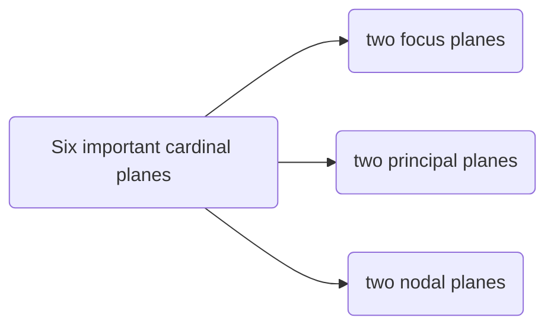
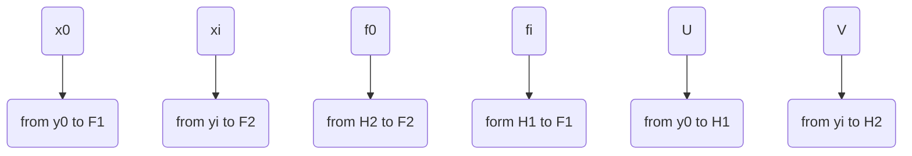
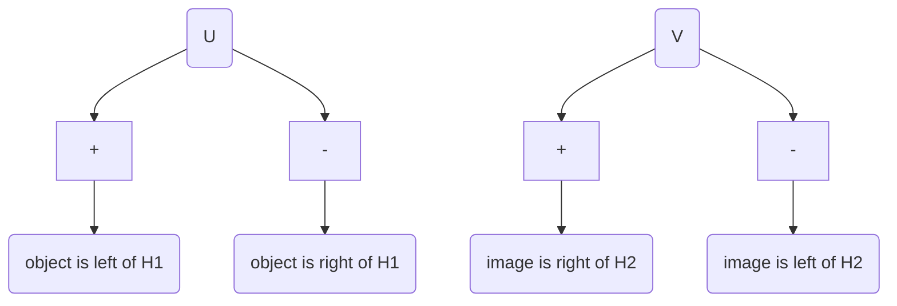
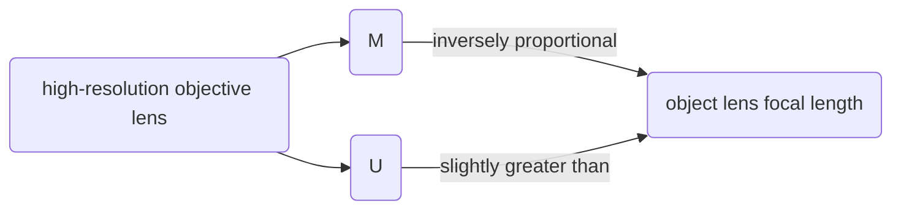
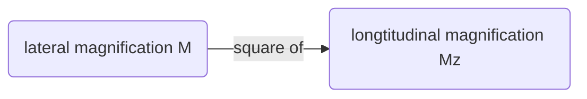

All content are summarised from High-Resolution Electron Microscopy (Fourth Edition, Oxford university press) of John C. H. Spence.

<!-- TOC GFM -->

* [The Electron Wavelength and Relativity](#the-electron-wavelength-and-relativity)
	- [Four Problems of EM](#four-problems-of-em)
	- [The Wavelength $\lambda$](#the-wavelength-lambda)
		+ [The Wavelength at the anode ($\lambda$)](#the-wavelength-at-the-anode-lambda)
		+ [The Wavelength Through the Specimen ($\lambda'$)](#the-wavelength-through-the-specimen-lambda)
* [Simple lens properties](#simple-lens-properties)
	- [The ideal lens](#the-ideal-lens)
		+ [Some Additional terms commonly used in electron optics](#some-additional-terms-commonly-used-in-electron-optics)
			* [1. lateral magnification](#1-lateral-magnification)
			* [2. The angular magnification](#2-the-angular-magnification)
			* [3. The entrance and exit pupils](#3-the-entrance-and-exit-pupils)
			* [4. The Gaussian reference sphere](#4-the-gaussian-reference-sphere)
			* [5. The longitudinal magnification](#5-the-longitudinal-magnification)
			* [6. Incoherent imaging theory](#6-incoherent-imaging-theory)

<!-- /TOC -->

## The Electron Wavelength and Relativity

### Four Problems of EM

Rather than solve the Schrodinger equation for the electron microscope as a whole, it is simpler to separate the four problems:

1. Beam–specimen interactions
2. Magnetic lens action
3. Detection
4. Fast electron sources

And a wavelength is assigned to the fast electron.

### The Wavelength $\lambda$ 

#### The Wavelength at the anode ($\lambda$)

From the ***de Broglie*** relation,

$$
p = mv = h/\lambda
$$

and 

$$
E = 1/2mv^2
$$

We can get the principle of conservation of energy applied to an electron of charge −e traversing a region in which the potential varies from $0$ to $V_0$:

$$
eV_0 = p^2/2m = h^2/2m\lambda^2 \tag{1}
$$

where where p is the electron momentum and h is Planck’s constant, and 

$$
\lambda = \frac{h}{\sqrt{2meV_0}} \tag{2}
$$

An electron leaves the filament with high potential energy and thermal kinetic energy, and arrives at the anode with no potential energy and high kinetic energy. The zero of potential energy is taken at ground potential. If $\lambda$ is in nanometres and $V_0$ in volts, then

$$
\lambda = 1.22639/\sqrt{V_0} \tag{3}
$$

At higher energies the relativistic variation of electron mass must be considered. Neglect of this leads to a 5% error in λ at 100 kV. The relativistically corrected mass is

$$
m = m_0/(1 - v^2/c^2)^{1/2} 
$$

and the relativistic equation corresponding to eqn $(1)$ is

$$
eV_0 = (m - m_0)c^2
$$

with $m_0$ the electron rest mass and c the velocity of light. These equations may be combined to give an expression for the electron momentum mv. Used in the *de Broglie* relation, this gives the relativistically corrected electron wavelength as

$$
\lambda = h/(2m_0eV_r)^{1/2} \tag{4}
$$

where

$$
V_r = V_0 + \left(\frac{e}{2m_0c^2}\right)V_0^2
$$

is the ‘relativistic accelerating voltage’, ***introduced as a convenience***. For computer calculations the value of $\lambda$ may be taken as

$$
\lambda = 1.22639/(V_0 + 0.97845 \times 10^{-6}V_0^2 )^{1/2} \tag{5}
$$

with $V_0$ the microscope accelerating voltage in volts and $\lambda$ in nanometres.

####  The Wavelength Through the Specimen ($\lambda'$)
The positive electrostatic potential $\phi(r)$ (in volts) inside the specimen further accelerates the incident fast electron, resulting in a small reduction in wavelength inside the specimen.

 

**Figure 1** Simplified potential energy (PE) diagram for an electron microscope. The length of the vertical arrow is proportional to the kinetic energy of the fast electron and inversely proportional to the square of its wavelength. The sum of the electron’s potential energy (represented by the height of the graph) and its kinetic energy is constant. Electrons leave the filament with low kinetic energy and high potential energy (supplied by the high-voltage set) and exchange this for kinetic energy on their way to the anode, which is at ground potential. As with a ball rolling down a hill, they are further accelerated as they ‘fall in’ to the specimen. Approximate distance down the microscope column is represented on the abscissa and the potential step at the specimen has been exaggerated.

The mean value of this inner potential is given by the zero-order Fourier coefficient of potential, $\upsilon_0 = \phi_0$. The refractive index $n$ of a material for electrons is then given by the ratio of wavelength $\lambda$ in a vacuum to that inside the specimen $\lambda$, so that

$$
n = \frac{\lambda}{\lambda'}=\frac{\left(\frac{1.23}{\sqrt{V_0}}\right)}{\left(\frac{1.23}{\sqrt{V_0 + \phi_0}}\right)}\approx 1 + \frac{\phi_0}{2V_0} \tag{6}
$$

**The phase shift** of a fast electron passing through a specimen of thickness t with respect to that of the vacuum is then

$$
\theta = 2\pi(n-1)t/\lambda = \pi\phi_0t/\lambda V_0 = \sigma\phi _0t \tag{7}
$$

Where, from the $eqn (1)$ we can get

$$
\begin{aligned}
\sigma & = \pi/\lambda V_0 \\
& = 2\pi me\lambda/h
\end{aligned}
$$

If the approximation is then made that the exit-face wave function can be found by computing its phase along a single optical path such as AB (contributions from paths such as CA has been neglected), as shown in Figure 2.

**Figure 2** The electron wave illustrated in two cases passing through a specimen. The wave passing through the centre of an atom (where the potential is high) has its wavelength reduced and so suffers a phase advance relative to the wave passing between the atoms, which experiences little change in its wavelength. The assumption of this simplified model, used in the phase grating approximation, is that the amplitude at A can be calculated along the optical path AB with no contribution at A from a point such as C. For thick specimens this approximation is unsatisfactory.

## Simple lens properties

At the high magnifications usually used for high-resolution microscopy, **the lens currents (which determine the focal lengths) of lenses L2, L3, and L4**, for example, might be used to control the magnification. For a fixed magnification setting, focusing is achieved by adjusting the strength of the objective lens L1 until the fixed plane P1 is conjugate to the exit face of the specimen.

**Figure 3** Ray diagram for an electron microscope with two condenser lenses, C1 and C2 and four imaging lenses, L1, L2, L3, and L4, operating at high magnification. A typical set of dimensions for D1 to D7 is given in Table 1, together with the possible range of focal lengths. These values may be used for examples throughout this book. Here OA is the objective aperture, P1 is a fixed plane, and SA is the selected area aperture.

| Distances btween lens centres (approximate) (mm) | Focal length range (mm) |
|--------------------------------------------------|-------------------------|
| D1 = 143.6                                       | 1.65 < f(C1) < 19       |
| D2 = 94.3                                        | 30 < f(C2) < 1060       |
| D3 = 251.4                                       | 15.4 < f((L2) < 281     |
| D4 = 215.5                                       | 3.1 < f((L3) < 99.5     |
| D5 = 44.9                                        | 2.06 < f(L4) < 16.4     |
| D6 = 73.6                                        |                         |
| D7 = 345.6                                       |                         |

**Table 1.** Electron-optical data for a typical electron microscope. For magnifications greater than 100 000 the magnification is controlled by adjusting the focal length of L3 with f(L2) = 15.4 mm fixed and f(L4) = 2.1 mm fixed. The focal length of L3 is set as follows: f(L3) = 9.8, 7.0, 5.0, 3.1 mm for M = 150, 200, 400, 750 K, respectively.

> Why to study electron optics, seeks to determine the conditions under which the electron wavefield passing through an electron lens satisfies the requirements for perfect image formation.

### The ideal lens

The ideal lens is a mathematical abstraction which provides perfect imaging given by a projective transformation between the object and image space.

The constants appearing in this transformation specify the positions of the cardinal planes of the lens. The six important cardinal planes are the two focus planes, the two principal planes, and the two nodal planes.

**Figure 4.** The thick lens. The nodal planes (N1, N2), principal planes (H1, H2), and focal planes (F1, F2) are shown together with the lens focal lengths ($f_i$, $f_0$)and the object focal distance $z_p$ . For a magnetic electron lens the principal planes are crossed.

Here comes a conclusion about $x_0$, $x_i$, $f_0$, $f_i$, $U$ and $V$.

For magnetic lenses the **nodal planes coincide with the principal planes**. The points where the axis crosses the nodal planes are called nodal points, N1 and N2. Principal planes are planes of unit lateral magnification, while nodal planes are planes of unit angular magnification. For an axially symmetric lens, the projective transformation for perfect imaging simplifies to

$$
\frac{y_i}{y_0} = \frac{f_i}{x_0} = \frac{x_i}{f_0} \tag{8}
$$

> $eqn(8)$ is called **the Newton's lens equation**.

The determination of the positions of these planes is the key problem of electron optics—once they are known, the rules for graphical construction of figures satisfying eqn $(8)$ can be used to find the image of an arbitrary object. 

The rule for a construction which gives the conjugate image point $P'$ of a known object point $P$ is:

1. Draw a ray through $P$ and $F_1$, intersecting $H1$ at $Q$. Through $Q$ draw a ray $YQ$ parallel to the axis extending into both object and image spaces. 
2. Draw a ray parallel to the axis through $P$ to intersect $H2$. From this intersection draw a ray through $F2$ to intersect the ray $YQ$ at $P'$. $P'$ is the image of $P$.

For the objective lens of a modern electron microscope operation at moderate magnificaiton (~ 40,000),

**Figure 5.** Ray diagram for the objective lens of a microscope operating at moderate magnification. The image is virtual and the principal planes are crossed. Object and image focal lengths are equal for magnetic lenses. A typical value for $f_2$ is 2 mm, and the magnification M = V/U may be about 20.

PS: $U$ is positive (negative) when the object is to the left (right) of $H1$, $V$ is positive (negative) when the image is to the right (left) of $H2$.

**The use of this mode in a four-lens instrument has advantages for biological specimens where radiation damage must be minimized**. At this moderate magnification lens L3 is switched off. At high magnification all lenses are used. Modern lens designers use the methods of matrix optics.

The simple thin-lens formula can still be used if **the object and image distances $U$ and $V$ are measured from the lens principal planes $H1$ and $H2$**. Equation (2.6) becomes

$$
\frac{f_i}{U} + \frac{f_0}{V} = 1
$$

As they are for **magnetic electron lenses, then the refractive indices in the object and images space are equal**, we get

$$
f_i = f_0 = f \tag{9}
$$

and

$$
\frac{1}{U} + \frac{1}{V} = \frac{1}{f} \tag{10}
$$

Eqn$(10)$ is quite gneral if 

From $eqn(10)$, there will be three cases:

1. $U < f$ : image is virtual, erect, and magnified.
2. $f < U < 2f$ : image is real, inverted, and magnified.
3. $U > 2f$ : image is real, inverted, and reduced.

From $eqn(10)$, Figure(4) and Figure(5)

#### Some Additional terms commonly used in electron optics

##### 1. lateral magnification 

The ***lateral magnification*** $M$ is given by

$$
M = \frac{y_i}{y_0} = - \frac{V}{U} \tag{11}
$$

from $eqn(10)$ and $eqn(11)$, we have 

$$
M - 1 = - \frac{V}{f} \tag{12}
$$

From $eqn(11)$ and $eqn(12)$, 

##### 2. The angular magnification
**The angular magnification** $m$ is, for small angles,

$$
m = \frac{\tan{\theta_i}}{\tan{\theta_0}} \approx \frac{\theta_i}{\theta_0} = \left|\frac{1}{M}\right| \tag{13}
$$

as shown in Figure 6,

**Figure 6.** Angular magnification. The image P of a point P is shown together with the angles which a ray makes with these points.

##### 3. The entrance and exit pupils
***The entrance and exit pupils*** of an optical system are important in limiting its resolution and light-gathering power.

**Entrance pupil**: The image of that aperture, formed by the optical system which precedes it, which subtends the smallest angle at the object. The **‘aperture stop’** is the physical aperture whose image forms the entrance pupil.

**Exit pupil**: The image of the entrance pupil formed by the whole system.

**Figure 7.** The entrance and exit pupils of an optic system. A complicated optical system consisting of many lenses can be treated as a ‘black box’ and specified by its entrance and exit pupils and a complex transfer function. A Huygens spherical wavefront is shown converging to an image point P.

**Figure 8.** A camera lens adjusted for large and small aperture. The entrance pupil is the image of the physical aperture, as seen through the front (the object side) of the lens. The size and location may differ from those of the physical aperture, due to magnification by the lens.

**Figure 9.** The image side of the lens of an SLR camera; the exit pupil is the light area in the middle of the lens.

##### 4. The Gaussian reference sphere

***The Gaussian reference sphere*** for an image point P is defined as the sphere, centred on P, which passes through the intersection of the optic axis with the exit pupil (as shown in the Figure 7).

For an unaberrated optical system, the surface of constant phase for a Huygens spherical wavelet converging toward P coincides with this reference sphere. **The deviation of the wavefront from the Gaussian reference sphere specifies the aberrations of the system**.

##### 5. The longitudinal magnification

***The longitudinal magnification***, $M_z$, can be used to **relate depth of field to depth of focus** (see below).

Differentiation of $eqn(10)$,

$$
\begin{aligned}
d\left(\frac{1}{V}\right) + d\left(\frac{1}{U}\right) & = d\left(\frac{1}{f}\right) \\
-\frac{1}{V^2}dV - \frac{1}{U^2}dU & = 0 \\ 
\frac{dV}{dU} & = - \frac{V^2}{U^2} \\
\end{aligned} \tag{14}
$$

Which makes,

$$
\frac{\Delta V}{\Delta U} = - M^2 = M_z
$$

For example the image planes conjugate to the upper and lower surfaces of an atom 0.3 nm ‘thick’ are separated by 3 m if the lateral magnification M is 100 000.

##### 6. Incoherent imaging theory

***Incoherent imaging theory*** gives the depth of field or range of focus values (referred to the object plane) over which an object point can be considered ‘in focus’ as

$$
Z_D = 2d/\theta = 2\lambda/\theta^2
$$

<++>

