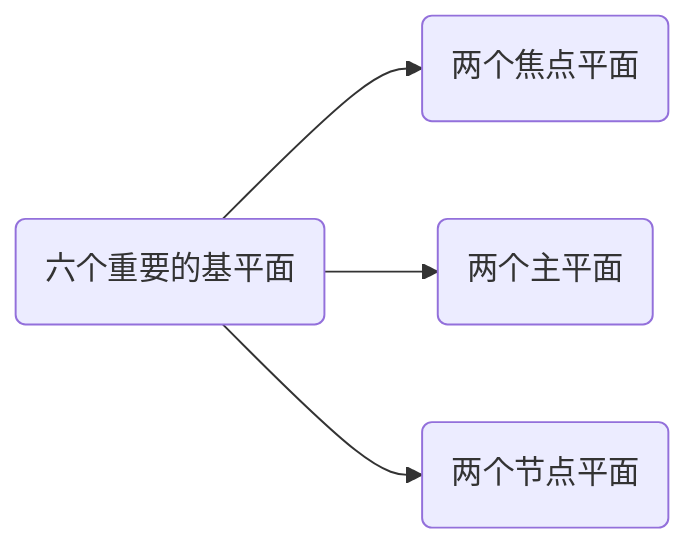
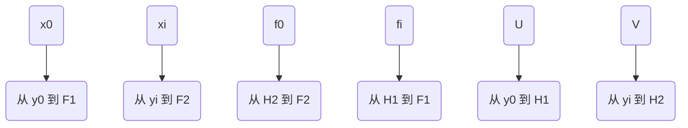
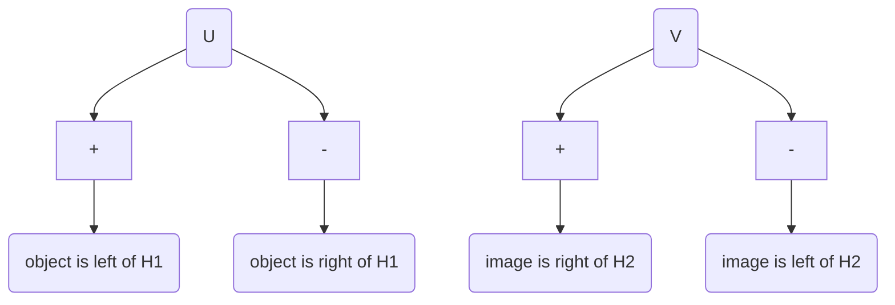
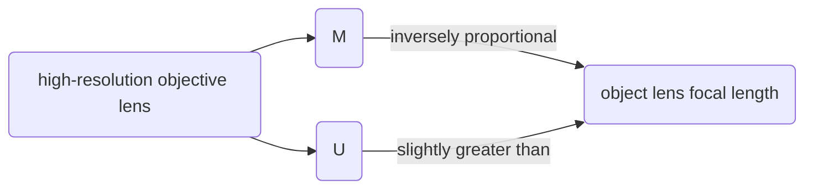
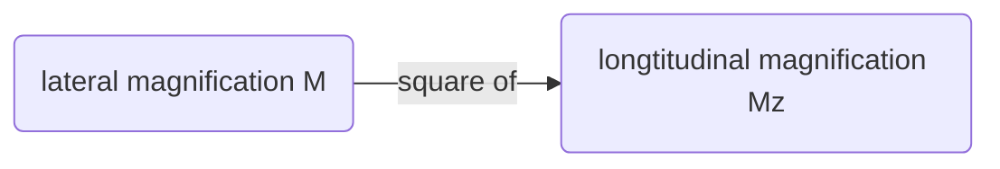

参考 John C. H. Spence 著作的 《High-Resolution Electron Microscopy》(Fourth Edition, Oxford university press)。

<!-- TOC GFM -->

* [一、与电子波长相关的一些内容](#一与电子波长相关的一些内容)
	- [1.1 电子显微镜的四个问题](#11-电子显微镜的四个问题)
	- [1.2 波长 $\lambda$](#12-波长-lambda)
		+ [1.2.1 阳极处的波长](#121-阳极处的波长)
		+ [1.2.2 穿过样品后的波长](#122-穿过样品后的波长)
* [简单透镜特点](#简单透镜特点)
	- [理想透镜](#理想透镜)
		+ [Some Additional terms commonly used in electron optics](#some-additional-terms-commonly-used-in-electron-optics)
			* [1. lateral magnification](#1-lateral-magnification)
			* [2. The angular magnification](#2-the-angular-magnification)
			* [3. The entrance and exit pupils](#3-the-entrance-and-exit-pupils)
			* [4. The Gaussian reference sphere](#4-the-gaussian-reference-sphere)
			* [5. The longitudinal magnification](#5-the-longitudinal-magnification)
			* [6. Incoherent imaging theory](#6-incoherent-imaging-theory)

<!-- /TOC -->

## 一、与电子波长相关的一些内容

### 1.1 电子显微镜的四个问题

与其使用 Schrodinger 方程将电子显微镜作为一个整体去研究，将其拆分为四个问题更为简单。

1. 电子束与样品的相互作用
2. 磁透镜作用
3. 检测
4. 快速电子源

波长这部分归于快速电子。

### 1.2 波长 $\lambda$ 

#### 1.2.1 阳极处的波长

根据 ***de Broglie*** 关系式，

$$
p = mv = h/\lambda
$$

以及 

$$
E = 1/2mv^2
$$

根据能量守恒定律，分析带有 $-e$ 电荷的电子穿过电势从 $0$ 到 $V_0$ 变化的区域。可以得到

$$
eV_0 = p^2/2m = h^2/2m\lambda^2 \tag{1}
$$

其中 $P$ 为 电子的动量，而 $h$ 为 ***Plank's*** 常量。

$$
\lambda = \frac{h}{\sqrt{2meV_0}} \tag{2}
$$

一个电子离开具有高势能以及高热动能的灯丝，并以无势能和高动能到达阳极。势能为零取接地电位。如果 $\lambda$ 以纳米为单位，$V_0$ 以伏特为单位，有

$$
\lambda = 1.22639/\sqrt{V_0} \tag{3}
$$

在使用更高能量时，就需要考虑电子的相对论变化。比如在 100 kV 时，忽略这一点会导致 $\lambda$ 产生 5 % 的误差。经过相对论修正后的质量为

$$
m = m_0/(1 - v^2/c^2)^{1/2} 
$$

对应于 $eqn(1)$ 的相对论方程为

$$
eV_0 = (m - m_0)c^2
$$

其中 $m_0$ 为电子静止状态下的质量，$c$ 是光速。这些等式可以结合并给出电子动量 $mv$ 的表达式。在 ***de Broglie*** 关系式中使用，给出相对论修正的电子波长为

$$
\lambda = h/(2m_0eV_r)^{1/2} \tag{4}
$$

其中

$$
V_r = V_0 + \left(\frac{e}{2m_0c^2}\right)V_0^2
$$

这里为了表述方便，引入$V_r$，称为 **"相对论加速电压"**。电脑计算时，$\lambda$ 可以取

$$
\lambda = 1.22639/(V_0 + 0.97845 \times 10^{-6}V_0^2 )^{1/2} \tag{5}
$$

其中 $V_0$，显微镜加速电压单位为伏特，$\lambda$ 单位为纳米。

#### 1.2.2 穿过样品后的波长

样品内部的正静电电位 $\phi(r)$ 会进一步加速入射的快速电子，导致样品中的波长会少量降低。

 

> **图1.** 电子显微镜势能（PE）的简单示意图。垂直箭头的长度与快速电子动能呈正比，与快速电子波长的平方成反比。电子势能（图中以高度表示）和电子的动能的总和是不变的。电子在离开灯丝时具有低动能与高势能（由高压装置提供），势能在通向阳极过程中逐渐转变为动能（阳极处为地电位)。就像小球从山上滚下来，跌进样品中一样。在显微镜立柱（microscope column）中向下的大概距离由横坐标表示，样品处的电位跃阶（potential step）被夸张展示。

忽略引起衍射和色散表面构造的周期性电位变化，内部电位的平均值由 $\upsilon_0 = \phi_0$ 给出，即电位的零阶傅里叶系数。 真空中波长 $\lambda$ 与电子进入样品后波长 $\lambda'$ 之间的比可以由材料中的折射率 $n$ 来表示。

$$
n = \frac{\lambda}{\lambda'}=\frac{\left(\frac{1.23}{\sqrt{V_0}}\right)}{\left(\frac{1.23}{\sqrt{V_0 + \phi_0}}\right)}\approx 1 + \frac{\phi_0}{2V_0} \tag{6}
$$

快速电子穿过厚度为 $t$ 的样品后，相对于真空中的相位差为

$$
\theta = 2\pi(n-1)t/\lambda = \pi\phi_0t/\lambda V_0 = \sigma\phi _0t \tag{7}
$$

结合 $eqn(1)$，我们可以得到

$$
\begin{aligned}
\sigma & = \pi/\lambda V_0 \\
& = 2\pi me\lambda/h
\end{aligned}
$$

如果利用沿单一光路，如 $AB$ ,来估计出射面波函数（不考虑如 $CA$ 通路）, 如图2所示。

> **图2.** 电子波穿过样品的两种情况。穿过原子中心（电势更高）的电子会降低波长，相对于从原子之间通过而不改变波长的电子，会发生波相位提前。在相位光栅近似中，这一最简单模型的假设是在 $A$ 处的振幅可以沿光路 $AB$ 计算而 $A$ 处没有来自诸如 $C$ 点的贡献；。对于厚样品，这种近似效果不好。

## 简单透镜特点

现代电子显微镜有着许多焦距可变的成像透镜，为聚焦的目的，需要固定物体及最终观察用的屏幕位置。在高分辨率显微镜中常用的高放大倍率下，例如$L2$，$L3$，及 $L3$ 的透镜电流（决定了焦距）能够被用来调节放大倍率，如图3所示。对于固定放大倍率的配置下，可通过调整物镜 $L1$ 的强度直至固定的 $P1$ 平面与样品的出射面共轭来实现对焦。

 

> **图3** 在高放大倍率下使用的，具有两个聚光透镜（condenser lenses），$C1$ 和 $C2$，以及四个成像透镜，$L1$，$L2$ 和 $L3$ 的电子显微镜示意图。典型的 $D1$ 至 ，$D7$ 尺寸以及可能的焦距范围于表1给出。其中 $OA$ 是物镜孔径，$P1$ 是固定平面，$SA$ 是选定区域的孔径。

| 透镜间的估计距离 (mm) | 焦距范围 (mm)       |
|-----------------------|---------------------|
| D1 = 143.6            | 1.65  < f(C1) < 19  |
| D2 = 94.3             | 30 < f(C2) < 1060   |
| D3 = 251.4            | 15.4 < f((L2) < 281 |
| D4 = 215.5            | 3.1 < f((L3) < 99.5 |
| D5 = 44.9             | 2.06 < f(L4) < 16.4 |
| D6 = 73.6             |                     |
| D7 = 345.6            |                     |

> **表1.** 典型电子显微镜的电子光学数据。对于放大倍率超过 100 000 情况，放大倍数通过 $f(L2) = 15.4mm$ ，$f(L4) = 2.1 mm$ 固定不变，调整 $L3$ 的焦距来进行控制。$L3$ 焦距分别以以下参数进行设置： $f(L3) = 9.9，7.0，5.0，3.1 mm$ 对应 $M = 150，200，400，750 K$ 。

### 理想透镜

理想透镜是一种数学上的抽象，可以通过物体和图像空间的投影变换来提供完美的成像。在这一变换中出现的常数，指定了透镜基平面的位置。六个重要的基平面包括两个焦点平面、两个主平面以及两个节点平面，如图4所示。

 

> **图4** 厚透镜。节点平面（$N1$，$N2$），主平面（$H1$，$H2$）以及焦点平面 （$F1$，$F2$）。透镜焦距为 $f_i$，$f_0$，物焦距为 $z_p$ 。对于磁电子透镜，主平面是交叉的。

从图中总结，$x_0$，$x_i$，$f_0$，$f_i$，$U$，以及 $V$ 分别表示为

 

对于磁透镜，**节点平面与主平面重合**。轴与节点平面相交的点成为节点，$N1$ 与 $N2$。**主平面为单位横向放大平面**，而**节点平为单位角度放大平面**。对于轴对称透镜，完美成像的投影可以简化为牛顿透镜方程:

$$
\frac{y_i}{y_0} = \frac{f_i}{x_0} = \frac{x_i}{f_0} \tag{8}
$$

解决这些平面的位置是解决电子透镜的关键问题，满足 $eqn(8)$ 图像的图形构造规则可以用于找到任意物体的图像。

 

从已知物点 $P$ 构建共轭像点 $P'$ 的规则：

1. 通过 $P$ 和 $F_1$ 画一条射线，与 $H1$ 平面交于 $Q$。通过 $Q$ 平行于轴画出射线 $YQ$，延伸到物体和图像空间。
2. 通过 $P$ 平行于轴绘制射线并与 $H2$ 相交。从这个交点画一条穿过 $F2$ 的射线，与 $YQ$ 在 $P$ 处相交于 $P'$。$P'$ 是 $P$ 的像。

以中等放大倍率（~ 40,000）的现代的电子显微镜为例，如图5所示。

> **图5.** 中等放大倍率的物镜射线图。物焦距与像焦距与磁透镜相等。典型的 $f_2$ 值为 2 mm，放大倍数 $M = V/U$ 大约为 20。

**The use of this mode in a four-lens instrument has advantages for biological specimens where radiation damage must be minimized**. At this moderate magnification lens L3 is switched off. At high magnification all lenses are used. Modern lens designers use the methods of matrix optics.

The simple thin-lens formula can still be used if **the object and image distances $U$ and $V$ are measured from the lens principal planes $H1$ and $H2$**. Equation (2.6) becomes

$$
\frac{f_i}{U} + \frac{f_0}{V} = 1
$$

As they are for **magnetic electron lenses, then the refractive indices in the object and images space are equal**, we get

$$
f_i = f_0 = f \tag{9}
$$

and

$$
\frac{1}{U} + \frac{1}{V} = \frac{1}{f} \tag{10}
$$

$U$ is positive (negative) when the object is to the left (right) of $H1$, $V$ is positive (negative) when the image is to the right (left) of $H2$.

Eqn$(10)$ is quite gneral if 

From $eqn(10)$, there will be three cases:

1. $U < f$ : image is virtual, erect, and magnified.
2. $f < U < 2f$ : image is real, inverted, and magnified.
3. $U > 2f$ : image is real, inverted, and reduced.

From $eqn(10)$, Figure(4) and Figure(5)

#### Some Additional terms commonly used in electron optics

##### 1. lateral magnification 

The ***lateral magnification*** $M$ is given by

$$
M = \frac{y_i}{y_0} = - \frac{V}{U} \tag{11}
$$

from $eqn(10)$ and $eqn(11)$, we have 

$$
M - 1 = - \frac{V}{f} \tag{12}
$$

From $eqn(11)$ and $eqn(12)$, 

##### 2. The angular magnification
**The angular magnification** $m$ is, for small angles,

$$
m = \frac{\tan{\theta_i}}{\tan{\theta_0}} \approx \frac{\theta_i}{\theta_0} = \left|\frac{1}{M}\right| \tag{13}
$$

as shown in Figure 6,

**Figure 6.** Angular magnification. The image P of a point P is shown together with the angles which a ray makes with these points.

##### 3. The entrance and exit pupils
***The entrance and exit pupils*** of an optical system are important in limiting its resolution and light-gathering power.

**Entrance pupil**: The image of that aperture, formed by the optical system which precedes it, which subtends the smallest angle at the object. The **‘aperture stop’** is the physical aperture whose image forms the entrance pupil.

**Exit pupil**: The image of the entrance pupil formed by the whole system.

**Figure 7.** The entrance and exit pupils of an optic system. A complicated optical system consisting of many lenses can be treated as a ‘black box’ and specified by its entrance and exit pupils and a complex transfer function. A Huygens spherical wavefront is shown converging to an image point P.

**Figure 8.** A camera lens adjusted for large and small aperture. The entrance pupil is the image of the physical aperture, as seen through the front (the object side) of the lens. The size and location may differ from those of the physical aperture, due to magnification by the lens.

**Figure 9.** The image side of the lens of an SLR camera; the exit pupil is the light area in the middle of the lens.

##### 4. The Gaussian reference sphere

***The Gaussian reference sphere*** for an image point P is defined as the sphere, centred on P, which passes through the intersection of the optic axis with the exit pupil (as shown in the Figure 7).

For an unaberrated optical system, the surface of constant phase for a Huygens spherical wavelet converging toward P coincides with this reference sphere. **The deviation of the wavefront from the Gaussian reference sphere specifies the aberrations of the system**.

##### 5. The longitudinal magnification

***The longitudinal magnification***, $M_z$, can be used to **relate depth of field to depth of focus** (see below).

Differentiation of $eqn(10)$,

$$
\begin{aligned}
d\left(\frac{1}{V}\right) + d\left(\frac{1}{U}\right) & = d\left(\frac{1}{f}\right) \\
-\frac{1}{V^2}dV - \frac{1}{U^2}dU & = 0 \\ 
\frac{dV}{dU} & = - \frac{V^2}{U^2} \\
\end{aligned} \tag{14}
$$

Which makes,

$$
\frac{\Delta V}{\Delta U} = - M^2 = M_z
$$

For example the image planes conjugate to the upper and lower surfaces of an atom 0.3 nm ‘thick’ are separated by 3 m if the lateral magnification M is 100 000.

##### 6. Incoherent imaging theory

***Incoherent imaging theory*** gives the depth of field or range of focus values (referred to the object plane) over which an object point can be considered ‘in focus’ as

$$
Z_D = 2d/\theta = 2\lambda/\theta^2 \tag{15}
$$

where $\theta$ is the objective aperture semi-angle and $d$ is the microscope resolution. However, this result cannot be accurately applied to the coherent high-resolution imaging of phase objects (see Sections 3.4 and 5.2).

