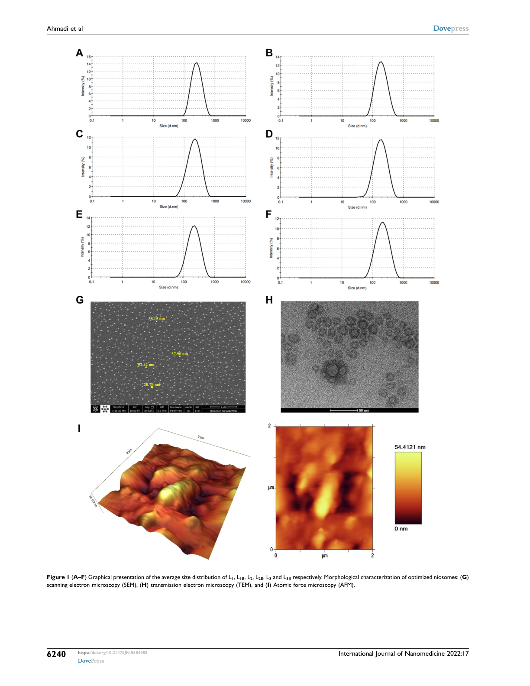
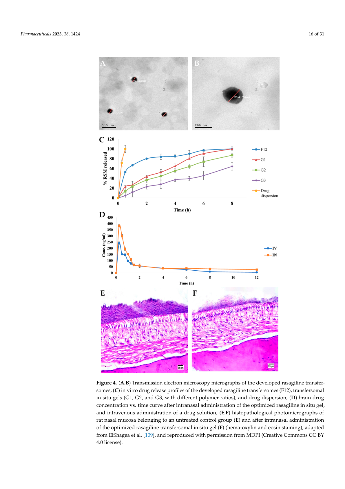
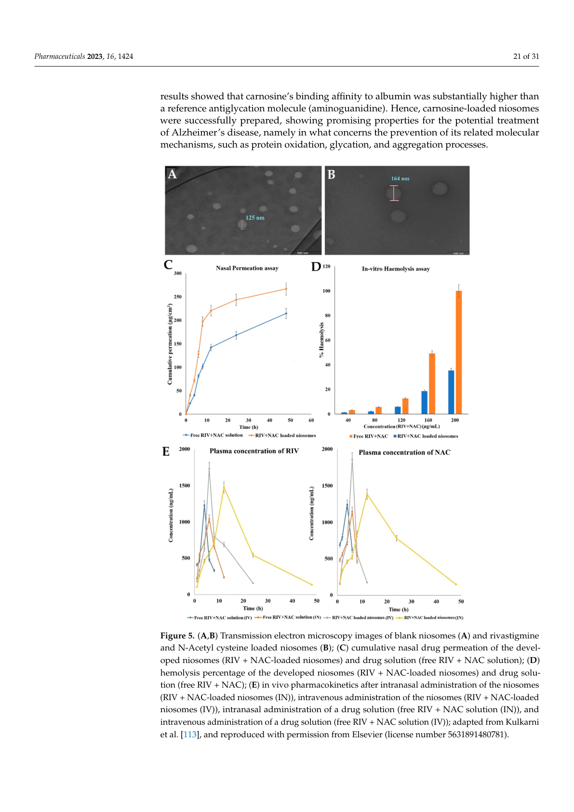

# 神经递质/药物载体的电镜证据综述：从 drug-loaded vesicle 到 EDS 可解释性

## 一句话总纲

如果目标是做“能包裹神经递质或药物、能在常温 TEM 或 cryo-TEM 下看到、后续还能考虑 EDS/元素分析”的载体体系，最稳妥的阅读顺序不是先按材料名排列，而是先问三个问题：第一，载体里是否真的装了 drug/cargo；第二，电镜图像是否展示了 drug-loaded formulation 的形貌；第三，这个体系是否有可供 EDS 解释的元素手柄。按这个标准，当前 EDS collection 里最直接的图证据来自 letrozole-loaded nanoniosomes、rasagiline transfersomes、rivastigmine/N-acetyl cysteine-loaded niosomes，以及 dopamine-loaded blood exosomes 这几类药物递送体系 [S2,S11,S17]。

## 1. 先区分“有电镜图”和“有 drug-loaded 电镜图”

这个 collection 里有不少文章提到 TEM、cryo-TEM、SEM、EDS 或 EELS，但它们的证据强度不同。对我们的目标来说，最有价值的是图注或正文明确把电镜图和 drug-loaded carrier 绑定起来的文献，而不是只展示空白颗粒、材料结构或方法学示例。

| 证据等级 | 判定标准 | collection 中的代表 |
| --- | --- | --- |
| 直接证据 | 图注或正文明确写 drug-loaded formulation，并有 TEM/SEM/cryo-TEM 图 | letrozole-loaded nanoniosomes [S11]；rasagiline transfersomes [S17]；RIV+NAC-loaded niosomes [S17] |
| 中等证据 | 文章主题是 drug-loaded carrier，电镜图展示 carrier 形貌，但图中不一定直接区分 loaded 与 unloaded | dopamine-loaded blood exosomes [S2]；bromocriptine niosomes [S3] |
| 方法学证据 | 文章说明 drug-delivery nanocarriers 的 TEM/cryo-TEM 解释原则，但不是某一个神经递质/药物装载体系 | DLS/TEM roadmap [S9]；cryo-TEM for colloidal drug delivery systems [S10] |
| EDS/元素分析证据 | 说明元素分析能做什么、不能做什么，但未必是 drug-loaded vesicle | EDS limitation / biological elemental mapping [S12,S18] |

这个区分很重要。裸 dopamine、GABA、glutamate 等小分子主要由 C/H/N/O 构成，常规 EDS 很难把它们从有机背景里直接识别出来。因此，如果课题要求“drug + EM + EDS”，电镜图可以证明载体形貌，EDS 更适合证明元素 reporter、金属/碘/硅/磷等可识别手柄，而不是直接证明裸神经递质本身 [S12,S18]。

## 2. Niosome 是最容易开工的常温 TEM 载体，但要看清楚 drug-loaded 证据

Niosome 的优势是工艺门槛低、常温操作友好、负染 TEM/SEM 容易出形貌图。它通常由非离子表面活性剂和 cholesterol 构成，比传统 phospholipid liposome 更适合做一个“先跑通制备和电镜”的入门体系。collection 中的 bromocriptine niosome 和 letrozole nanoniosome 都属于这个方向 [S3,S11]。

Ahmadi 等的 letrozole nanoniosome 工作是这里最适合作为“drug-loaded + EM figure”例子的文献之一。文章先用 DLS 比较不同 Span 和 lipid-to-drug ratio 的粒径分布，再对优化配方做 SEM、TEM 和 AFM。图 1 的 G/H/I 分别给出 SEM、TEM 和 AFM 形貌，正文同时说明这些是 optimized niosomal formulation，并结合 FT-IR、XRD、DSC 讨论 letrozole 被包入 niosome 的证据 [S11]。

图 1. Ahmadi 等 2022 的 Figure 1 页面。A-F 是 letrozole-loaded / empty niosome 相关配方的粒径分布；G 是 SEM，H 是 TEM，I 是 AFM。这里最值得看的是 H：TEM 看到的是纳米囊泡形貌，但它本身并不能单独证明 letrozole 在囊泡内，必须和包封率、FT-IR、XRD、DSC、释放曲线一起读 [S11]。

这类 niosome 图对我们有两个启发。第一，常温 TEM/SEM 可以快速判断颗粒是否成形、是否聚集、是否尺寸严重偏离 DLS。第二，drug loading 不能只靠电镜图证明，因为有机小分子在 TEM 图中通常不会形成可直接识别的元素或密度标签。真正稳妥的写法应该是“电镜确认 drug-loaded formulation 的载体形貌”，而不是“电镜直接看见 drug”。

## 3. Liposome-derived nanosystems 适合作为 drug-loaded EM figure 的图像来源

Pires 等的综述很适合用来补“包含 drug 的电镜图”，因为它整理的是 brain drug bioavailability 相关的 liposome-derived nanosystems，并且图注里明确出现了 drug-loaded formulation [S17]。

第一组图是 rasagiline transfersomes。Figure 4 的 A/B 是 developed rasagiline transfersomes 的 TEM micrographs，同一图里还放了 in vitro drug release、鼻腔给药后的 brain drug concentration 曲线，以及鼻黏膜组织学。这种组合比单独一张 TEM 更有解释力：TEM 告诉你 transfersome 形貌，释放曲线告诉你 drug release，药代曲线说明 intranasal formulation 的脑递送表现 [S17]。

图 2. Pires 等 2023 Figure 4 页面。A/B 是 rasagiline transfersomes 的 TEM micrographs；C 是 drug release；D 是 brain drug concentration vs. time；E/F 是鼻黏膜组织学。这个图的价值在于把“有 vesicle 形貌”与“药物释放和脑递送”放在同一个证据链中，而不是把 TEM 当成孤立装饰图 [S17]。

第二组图是 rivastigmine 和 N-acetyl cysteine loaded niosomes。Figure 5 的 A/B 分别是 blank niosomes 和 RIV+NAC-loaded niosomes 的 TEM 图，图注明确写出 loaded niosomes；C 是 nasal drug permeation，D 是 hemolysis，E 是体内药代曲线 [S17]。这比很多“只展示空白载体”的文章更适合放进综述，因为图本身就服务于 drug-loaded formulation 的验证。

图 3. Pires 等 2023 Figure 5 页面。A 是 blank niosomes，B 是 rivastigmine + N-acetyl cysteine loaded niosomes；后续面板展示鼻黏膜通透、溶血和药代。这里最适合强调“drug-loaded EM figure”的定义：电镜图展示的是载体形貌差异，drug 证据来自图注、配方、释放和药代数据共同支撑 [S17]。

## 4. Dopamine-loaded exosome 是最贴近“神经递质载体”的直接 precedent

如果题目强调 neurotransmitter，而不是一般 drug，那么 dopamine-loaded blood exosomes 是最关键的 precedent。Qu 等把 blood exosomes 与饱和 dopamine 溶液在含抗坏血酸条件下孵育，再用超速离心去除游离 dopamine；文章用 LC-MS/MS 测定装载量，并用 TEM 表征 exosome morphology [S2]。

这篇文章的优点是神经递质相关性强：dopamine 是明确 cargo，模型是 Parkinson disease，治疗读出包括脑组织 dopamine 分布、行为和氧化应激指标。限制也同样清楚：TEM 图主要证明 exosome 的囊泡形貌和粒径范围，并不能直接在图像里“看见 dopamine”。因此，在综述里建议把它写成“dopamine-loaded exosome 的载体形貌经 TEM 表征”，而不是“dopamine 被 TEM 直接成像”。

这类 EV/exosome 路线适合用来回答“是否已经有人真正装过神经递质”。但它不一定是最容易开工的路线，因为 exosome 的来源、纯化、批间一致性和纯度控制都比 niosome/liposome 更重。

## 5. Cryo-TEM 方法学告诉我们：常温 TEM 不能替代含水原生形态

Kuntsche 等的 cryo-TEM 综述和 Filippov 等的 DLS/TEM roadmap 都不是某一个单独神经递质载体的实验论文，但它们对方法判断很关键 [S9,S10]。常温 TEM 常需要负染、干燥和真空暴露，容易造成 vesicle 收缩、塌陷、边缘加厚、干燥伪影和粒径偏差。cryo-TEM 的优势是快速玻璃化，保留含水状态下的纳米结构，尤其适合 cubosome、liposome、emulsion、solid lipid nanoparticle 等软物质体系 [S10]。

这意味着：如果你的目标只是配方初筛，常温 TEM 足够；如果你的目标是证明“这个体系在水相里本来就是 vesicle / bicontinuous cubic phase / multilamellar particle”，cryo-TEM 的说服力更强。对于 cubosome 这类内部结构高度依赖水相环境的体系，cryo-TEM 比负染 TEM 更接近核心证据 [S4,S10,S15]。

## 6. EDS 的位置：不要硬证明裸 drug，要设计元素 reporter

EDS 对软纳米颗粒的最大问题是轻元素和背景。dopamine、GABA、glutamate、letrozole、bromocriptine 等有机小分子都以 C/H/N/O 为主，其中 H 不能被常规 EDS 检测，C/N/O 又容易和载体、支持膜、污染和生物背景重叠。因此，EDS 不适合直接回答“这个 vesicle 里面有没有裸 dopamine”。

更合理的路线是把 drug/cargo 证据和元素证据拆开：drug/cargo 用 LC-MS/MS、HPLC、UV、包封率、释放曲线、药效或荧光标记证明；EM 用 TEM/cryo-TEM 证明载体形貌；EDS/EELS 用元素 reporter 证明可定位的元素标签。collection 中的 iodine-rich polymersomes、protocell 和 biological elemental mapping 文献更适合作为“元素手柄/元素成像”的参考，而不是直接作为神经递质 EDS 证明 [S8,S13,S18]。

## 7. 推荐实验路线

如果目标是先做一个最小可行体系，我建议按以下顺序推进。

第一阶段，选 niosome 或简单 liposome，做常温 TEM + DLS + zeta + 包封率。这个阶段的目标是快速确认颗粒是否成形、尺寸是否稳定、drug loading 是否可测。letrozole nanoniosome 和 bromocriptine niosome 可以作为方法参考 [S3,S11]。

第二阶段，若必须强调神经递质，转向 dopamine-loaded exosome 或 dopamine-loaded liposome precedent。exosome 证据链更贴近真实 dopamine delivery，但实验门槛更高；liposome/niosome 更容易做，但需要额外证明 dopamine 稳定性和包封 [S1,S2]。

第三阶段，若文章要求高质量电镜图，加入 cryo-TEM。尤其是 cubosome、polymersome、protocell 这类体系，常温 TEM 的形貌可能不足以证明原生结构 [S4,S9,S10,S15]。

第四阶段，若必须做 EDS，不要把裸神经递质作为 EDS target，而是引入元素 reporter：例如 iodine-rich polymer、gold nanoparticle、magnetic particle、silica core 或含 P/S/halogen 的标记脂质。EDS 最适合证明“可定位元素标签”和“载体结构手柄”，不是证明 C/H/N/O 小分子本身 [S8,S12,S13,S18]。

## 图证据清单

| 图证据 | 文献 | 是否直接 drug-loaded | 电镜类型 | 处理方式 |
| --- | --- | --- | --- | --- |
| Letrozole-loaded / optimized nanoniosome morphology | Ahmadi 2022 [S11] | 是，结合配方、FT-IR/XRD/DSC 和释放证据 | SEM/TEM/AFM | 已插入图 1 |
| Rasagiline transfersomes | Pires 2023 转引 ElShagea et al. [S17] | 是，图注明确 rasagiline transfersomes | TEM | 已插入图 2 |
| RIV+NAC-loaded niosomes | Pires 2023 转引 Kulkarni et al. [S17] | 是，图注明确 loaded niosomes | TEM | 已插入图 3 |
| Dopamine-loaded blood exosomes | Qu 2018 [S2] | 中等：drug loading 明确，TEM 主要表征 exosome morphology | TEM | 不直接插图；适合作为神经递质 precedent |
| Bromocriptine niosomes | Sita 2020 [S3] | 中等：drug delivery 明确，需回看图注确认 loaded vs blank | TEM/形貌表征 | 候选图，不强插 |
| Cryo-TEM drug delivery morphology examples | Kuntsche 2011 [S10] | 方法学，不是单一神经递质 cargo | cryo-TEM | 用于方法讨论 |

## 来源缺口

当前 collection 还缺两类最关键的强证据。第一，直接展示 dopamine/GABA/glutamate-loaded niosome 或 cubosome 的 TEM/cryo-TEM 原始实验论文还不够；已有最强 dopamine precedent 是 exosome，而不是 niosome/cubosome [S2]。第二，drug/cargo 与 EDS 同时闭环的软纳米囊泡文献仍不足。若后续要把 EDS 写成核心卖点，最好主动设计元素 reporter，而不是依赖已有裸神经递质文献。

## 参考文献

- [S1] Liposomes containing dopamine entrapped in response to transmembrane ammonium sulfate gradient as carrier system for dopamine delivery into the brain of parkinsonian mice.
- [S2] Qu M, et al. Dopamine-loaded blood exosomes targeted to brain for better treatment of Parkinson's disease. *Journal of Controlled Release*. 2018. doi:10.1016/j.jconrel.2018.08.035.
- [S3] Sita VG, et al. Niosomes for nose-to-brain delivery of bromocriptine. *Journal of Drug Delivery Science and Technology*. 2020. doi:10.1016/j.jddst.2020.101791.
- [S4] Angelov B, et al. Identification of large channels in cationic PEGylated cubosome nanoparticles by synchrotron radiation SAXS and Cryo-TEM imaging. *Soft Matter*. 2015. doi:10.1039/C5SM00169B.
- [S8] Liu J, et al. Porous Nanoparticle Supported Lipid Bilayers (Protocells) as Delivery Vehicles. *JACS*. 2009. doi:10.1021/ja808018y.
- [S9] Filippov SK, et al. Dynamic light scattering and transmission electron microscopy in drug delivery. *Materials Horizons*. 2023. doi:10.1039/D3MH00717K.
- [S10] Kuntsche J, et al. Cryogenic transmission electron microscopy for studying colloidal drug delivery systems. *International Journal of Pharmaceutics*. 2011. doi:10.1016/j.ijpharm.2011.02.001.
- [S11] Ahmadi S, et al. In vitro Development of Controlled-Release Nanoniosomes for Letrozole. *International Journal of Nanomedicine*. 2022. doi:10.2147/IJN.S384085.
- [S12] Limitations of quantitative analysis - EDS. MyScope.
- [S13] Cao J, et al. Iodine-Rich Polymersomes Enable Versatile SPECT/CT Imaging and Radiotherapy. *ACS Applied Materials & Interfaces*. 2019. doi:10.1021/acsami.9b04294.
- [S15] Sivadasan D, et al. Cubosomes in Drug Delivery. *Biomedicines*. 2023. doi:10.3390/biomedicines11041114.
- [S17] Pires PC, et al. Liposome-Derived Nanosystems for the Treatment of Behavioral and Neurodegenerative Diseases. *Pharmaceuticals*. 2023. doi:10.3390/ph16101424.
- [S18] Wu JS, et al. Imaging and elemental mapping of biological specimens with a dual-EDS dedicated STEM. *Ultramicroscopy*. 2013. doi:10.1016/j.ultramic.2013.01.004.
